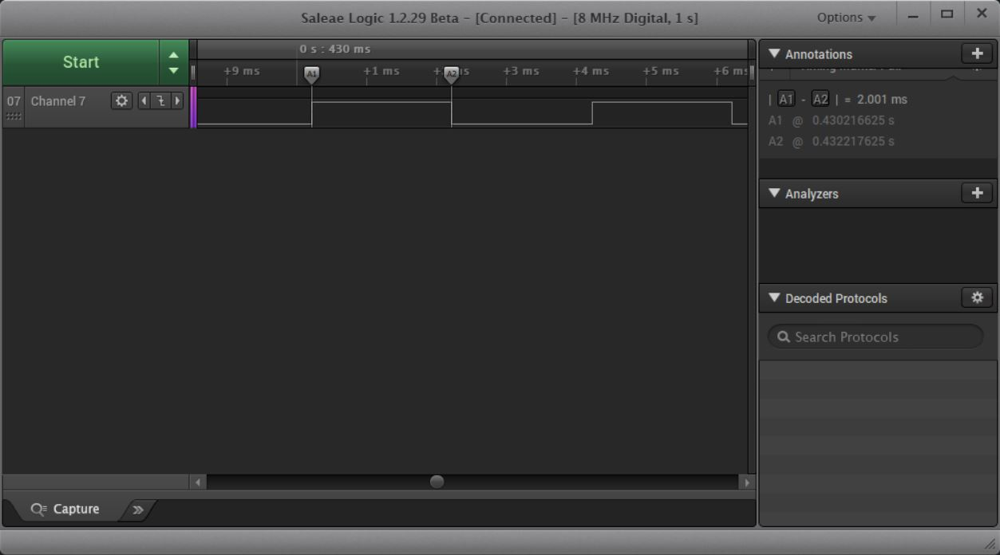
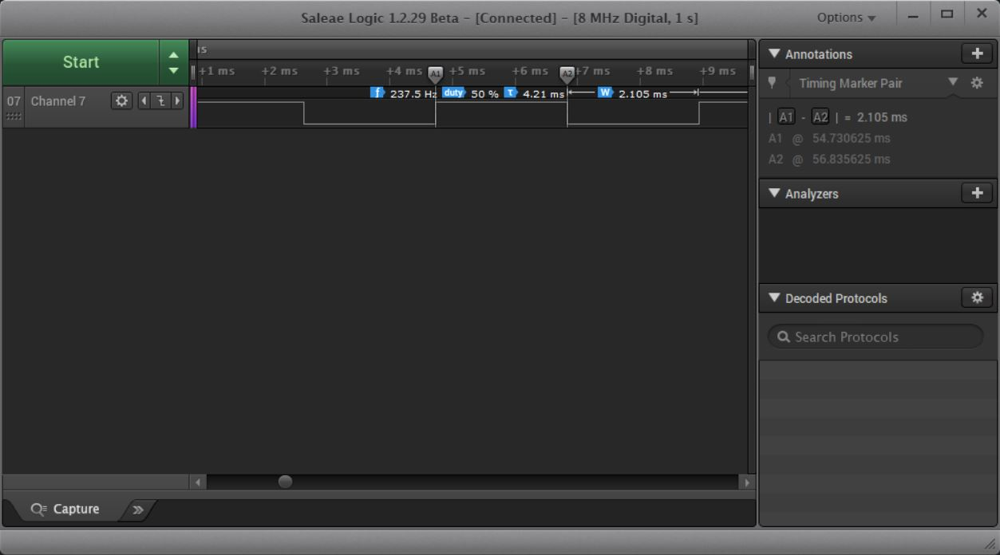
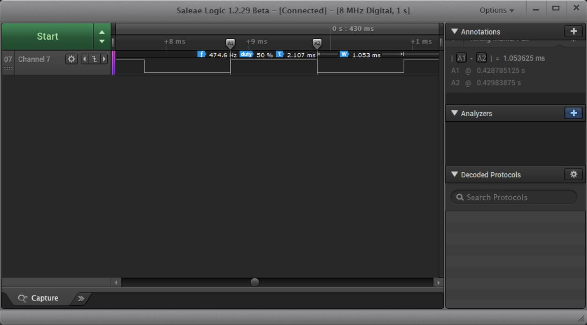

<h1>DWT Delay in millis or microsecond</h1>

DWT, Debug Watchpoint and Trace which usually used for system debugging and tracking

The purpose of this utilities is to achived precision millis and micro second timer with DWT

This utilities provide millis and micro second delay and interval measurement

Delay in HAL/LL is not accurate and there is always additional 1ms delay(refer to below)

There is some discussion on this issue in ST community forum : *[Here](https://community.st.com/s/question/0D50X00009XkXQA/llmdelay-taking-an-extra-millisecond)*

Delay using HAL_Delay:

Delay using LL_mDelay:

Delay using DwtDelay_ms:

